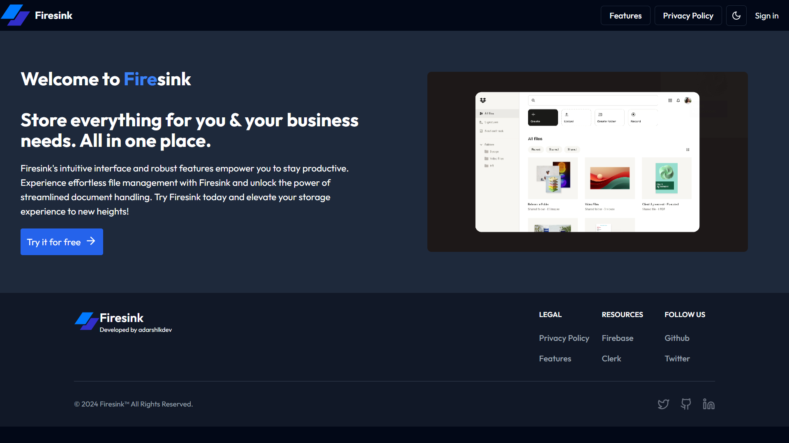

# FireSink - Your All-in-One File Storage Solution


FireSink is a robust file storage solution built with Next.js and TypeScript. It allows you to store all types of files (JPEG, PNG, DOCs, PPTX, MP4, etc.) with their timestamps of creation. It also provides the functionality to perform CRUD operations on them.



## Features

- File Upload: Upload any type of file to your storage.
- File Download: Download your files anytime, anywhere.
- File Update: Update the details of your stored files.
- File Delete: Delete any file if you no longer need it.
- Authentication: Secure authentication system powered by Clerk.
- Firebase Storage: All files are stored securely in Firebase Storage.
- Zustand : State management library


## Technologies Used

- Next.js
- TypeScript
- Firebase Storage
- Shadcn U
- Clerk
- Zustand

## Architecture


## Getting Started

First, run the development server:

[Watch the video](assets/demoVideo.mp4)

```bash
npm run dev
# or
yarn dev
